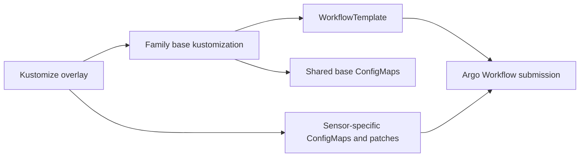

## High-Level Architecture

The workflow structure is organized by workflow family. Each family owns its
own base template and its own overlays, so new workflow templates can be added
without sharing names, ConfigMaps, or patches with existing families.

```text
workflows/
  calibration-group-and-convert/
    base/
      calibration-group-and-convert.yaml
      configmap-*.yaml
      kustomization.yaml
    overlays/
      cmp22/
      aepg600m/
      aepg600m_heated/
  <future-family>/
    base/
    overlays/
```



## Workflow Execution Flow

```text
$ kubectl apply -k workflows/calibration-group-and-convert/overlays/cmp22/
```

That render produces one WorkflowTemplate plus the base and overlay ConfigMaps
needed by that sensor. The overlay patches the template to point at the
sensor-specific env and resource ConfigMaps, while the family base supplies the
shared load-data, processing, upload-output, and schema ConfigMaps.

## Configuration Layout

The family base contains the reusable pieces:

```text
workflows/calibration-group-and-convert/base/
  calibration-group-and-convert.yaml
  configmap-load-data-instructions.yaml
  configmap-processing-instructions.yaml
  configmap-resource-request.yaml
  configmap-schemas.yaml
  configmap-upload-output-instructions.yaml
  kustomization.yaml
```

Each overlay contributes only the sensor-specific ConfigMaps and a small patch
to the WorkflowTemplate arguments.

## Runtime Layout

At runtime, the WorkflowTemplate consumes the rendered ConfigMaps and runs the
same container sequence for each sensor overlay:

```text
load-data -> processing -> main
```

The sensor overlay changes the environment values, resource requests, and
output paths, but the template logic stays the same.

## Deployment Topology

```text
Kubernetes cluster
  Namespace: argo-workflows-dev
    WorkflowTemplate: calibration-group-and-convert
    ConfigMaps from family base
    ConfigMaps from sensor overlay
```

If you later add another workflow family, give it the same `base/` and
`overlays/` shape under `workflows/<family>/` and keep its names isolated from
the existing family.

An optional top-level `workflows/kustomization.yaml` can aggregate multiple
families if you want a single entry point for `kubectl apply -k workflows/`.
If you deploy families independently, you do not need that extra layer.